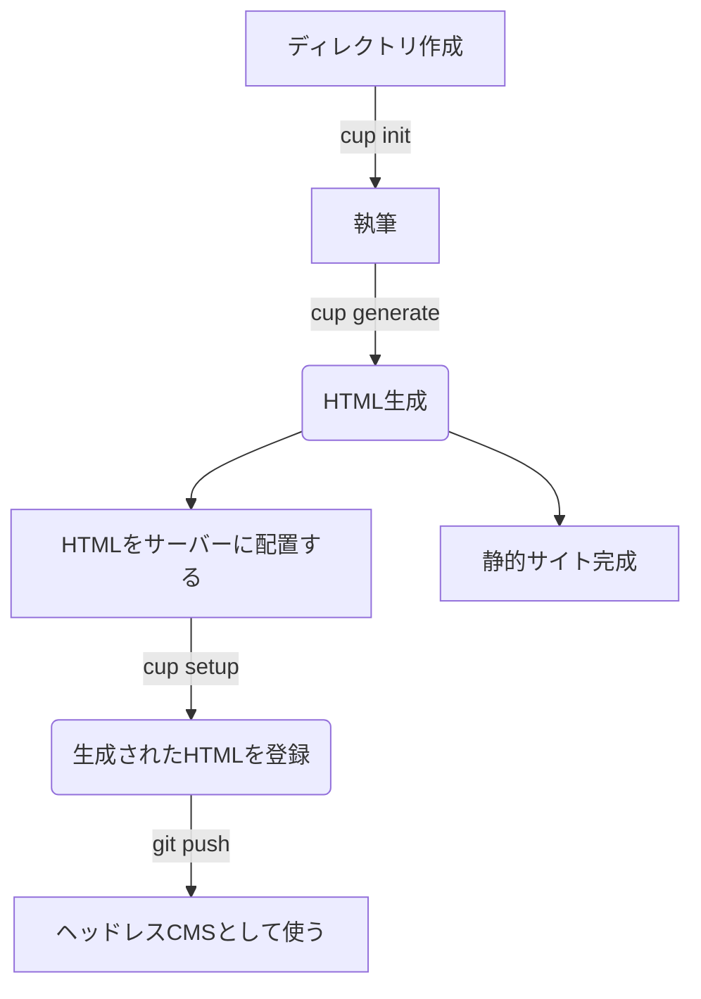

# cappuccino ☕

## **ようこそcappuccinoプロジェクトへ！**

**このプロジェクトはまだ構想段階で、今後大きな変更がされる可能性があります！気をつけて下さい！！**

cappuccinoは軽量さとシンプルであることを目標に開発しているヘッドレスCMSです！

主に以下のような人が使うのに向いていると考えています。

- とにかく覚えることが少ないCMSを使いたい
- サイトの見た目をHTMLとCSSでゴリゴリ書きたい
- 既存のツールの知識で楽をしたい

cappuccinoでは提供する機能を少なくして、
**なるべく一般的な技術(git, MarkDown, マスタッシュ構文など)でサイトを構築すること**を目標にしています。

## cappuccinoの概要

cappuccinoでは主に２つの機能で成り立つよう設計しています。

- オートリロードするサイトジェネレーター機能

cappuccinoでは静的サイトジェネレーターの機能を内蔵します。
この機能はエディタで編集しているMarkDownファイルを保存したときに自動でレンダリングが行われ、
プレビューが更新されるようにする予定です。

- ヘッドレスCMS

cappuccinoが提供する機能の２つ目はCMSです。これは[FastAPI](https://fastapi.tiangolo.com/)を使って、
ファイルのルーティングなどをサポートしようと考えています。
また、この機能は**Pythonが動く環境でデプロイしないと使えません。** 注意してください！

## 想定している使い方

**この図に出てきている`cup`コマンドはまだ想定段階です。コマンド名が変わるかもしれません。**
また、静的サイトのホスティングはGithub Pages、ヘッドレスCMSのホスティングはHerokuを想定しています。
そしてHTMLレンダリングには[mistletoe](https://github.com/miyuchina/mistletoe)と[Jinja](https://github.com/pallets/jinja)を採用しています。

ページはMarkDownで書きます。またテンプレートエンジンJinjaを使い、外部ファイルの埋め込みなどもサポートする予定です。

## 特徴
cappuccinoCMSでは以下の機能を実装予定です。

### 概要に書いた2つの機能

まずこの機能がないとcappuccinoは機能しません。なのでこの２つの機能を最優先で実装します。

### ドキュメント

直接は関係してきませんが、とても大切なものだと考えています。
僕は最近[wezterm](https://wezfurlong.org/wezterm/)というターミナルを使っているのですが、
そのプロジェクトのドキュメントが個人プロジェクトとは思えないくらい充実していて圧倒されたので、
weztermまでとは行かなくとも分かりやすく親切なドキュメントを整備していきたいです。

### Front matter

ZennのMarkDownなどでよく見る`---`で囲まれた部分のことです。
これを使うことでファイルにメタデータを付与でき、ページの管理が楽になります。
cappuccinoではYAMLを採用する予定です。

### テーマ機能

capputinoではテーマを自由に作成して自由にインストール出来るようにする予定です。
また、テーマを開発する際にCSSライブラリを使用したり、後述のスタイルガイドジェネレーターを使えるようにする予定です。
外部テーマを使う方法としては、`git submodule`を検討しています。

### スタイルガイドジェネレーター

最近Twitterでスタイルガイドジェネレーターと言うものを知りました。
コードだけでは分かりづらい各パーツを図鑑のように見れるのは、
デザインが重要なサイト開発においてとても重要だと強く感じました。

### プラグイン機構

僕は以前bundlerというプラグインマネージャのようなものを開発していました。(公開はしていません)
その開発で得たプラグイン機構の知識を活かしてこの機能を実装する予定です。

## 今は実装しない機能
**cappuccinoではサポートしない機能もあります。**

- Vue, Reactなどのサポート

cappuccinoはMarkDownをHTMLにレンダリングし、サイトを構築する事を想定しています。
なので、VueやReactで静的サイトを開発したい場合は[GridSome](https://gridsome.org/)や[Next.js](https://nextjs.org/)をオススメします。
しかし、このようなJavaScriptフレームワークとの連携は**こまもか自身もとても興味がある**ので、
今後拡張機能などの形で実装するかもしれません。

- 管理画面・Webエディタのサポート

突然ですが皆さん、MarkDownはどのようなエディタで書いているでしょうか？
VSCode? Atom? **Vim?** 色々あると思いますが、僕こまもかはVimで書いています。
僕個人の考えとしては**記事など内容が大事なものほど自分好みのエディタを使って書くべき**だと思っています。
なので、Webエディタの実装は致しません。管理画面についてですが、僕の今現在の技術力では僕自身が自信をもって
提供出来るクォリティの管理画面を**提供出来るとは思えない**ので開発致しません。ごめんなさい。

## 開発に参加するには

cappuccinoプロジェクトでのDiscordサーバーの運営などはしないつもりです。また、しばらくは単独で開発します。
機能追加などをしたいと思ったときは[こまもかのTwitteer](https://twitter.com/Comamoca_)のDMや[Github Issue](https://github.com/Comamoca/cappuccino/issues/new?assignees=Comamoca&labels=%E6%A9%9F%E8%83%BD%E3%83%AA%E3%82%AF%E3%82%A8%E3%82%B9%E3%83%88&template=---------.md&title=%E8%BF%BD%E5%8A%A0%E6%A9%9F%E8%83%BD%E3%81%AE%E3%83%AA%E3%82%AF%E3%82%A8%E3%82%B9%E3%83%88)などでお願いします。

また、このリポジトリでは**日本語でIssue送って大丈夫です！むしろウェルカム**です！
I'll do my best to read it, even if it's in English, so feel free to post an Issue, I'd appreciate it!

## よくありそうな質問

- Q. cappuccinoってどう読みますか？
- A. カプチーノです！スペルは「かぷぷうちちいの」と覚えると覚えやすいです！
---
- Q. なんでcappuccinoを作ろうと思ったの？
- A. 先日とあるヘッドレスCMSを使っていたのですが、使い方が複雑でどうも自分には合っていないと感じ、
どうせならヘッドレスCMSの仕組みの勉強も兼ねて自作してみようと思い開発を始めました。
---

他にも多く寄せられた質問、ここに書くべき質問などはここに追加していきます！
